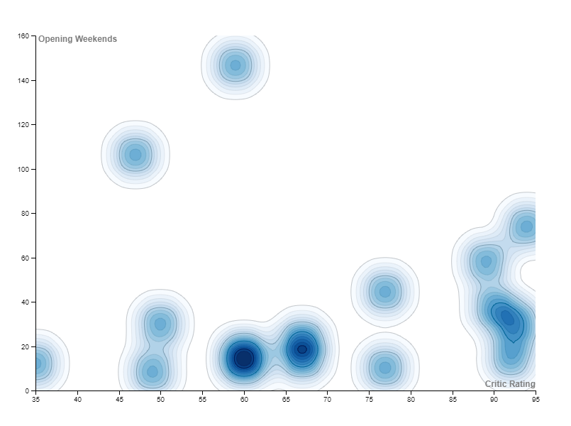
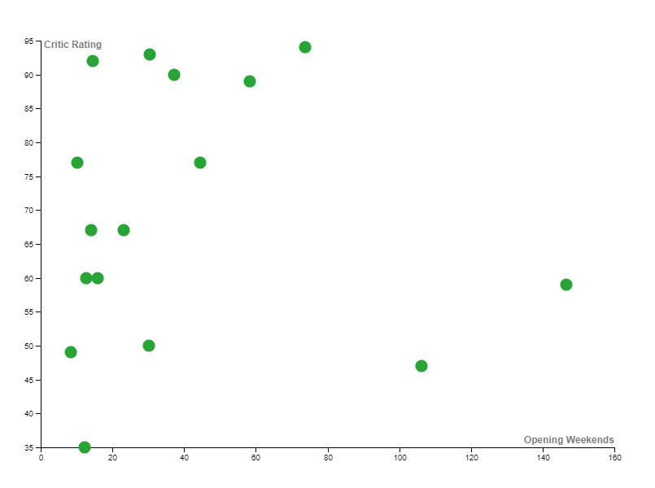
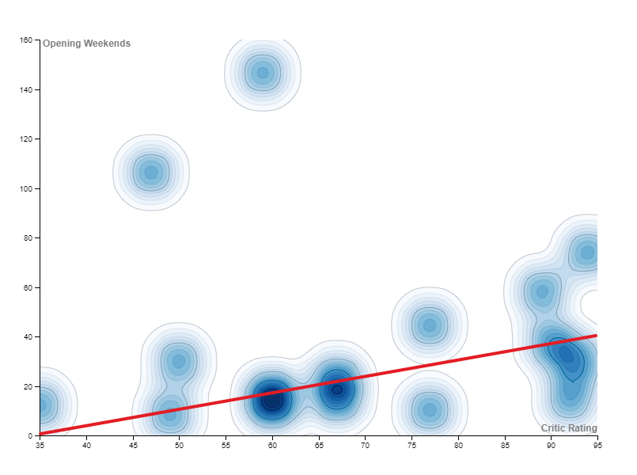
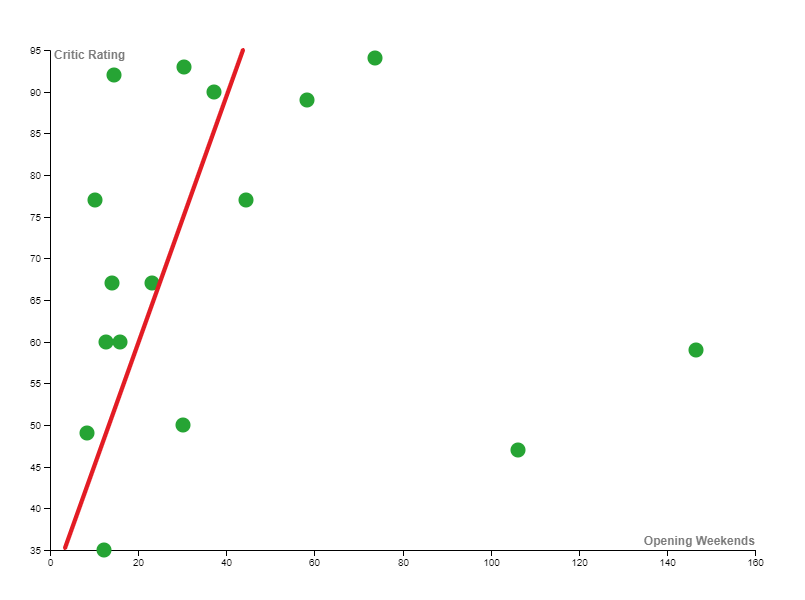
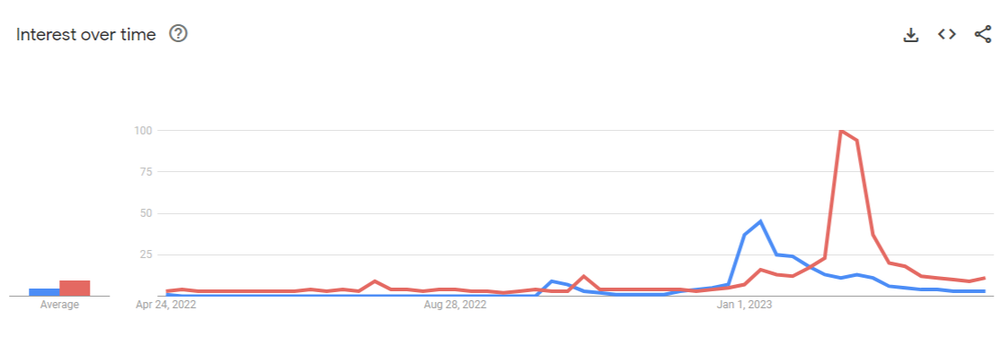

# 
Examining the impact that movie critics have on the opening week box office success of a film
## 
Showcasing RAWGRAPHS and Google trends as effective digital tools for the humanities 
### 
7241755 
### 
Noah Parfett 
### 
Professor A. Mauro 
### 
April 20, 2023

## Abstract:

This research project will aim to examine the relationship between critic reviews and opening week box office performance. This project is an extension of the previous report investigating the effect of an individual actor's fame on the Metacritic reviews they receive. The overall goal of these reports is to figure out the factors that determine a successful film in today's society. Is film truly subjective media, or can a series of quantifiable factors explain the success of a film? This project will demonstrate the potential for digital humanities methodologies to investigate complex social phenomena and provide a framework for future research in this field. Digital tools will also be used to reveal the results in a compelling way. The goal is to ultimately determine whether a critic's opinion/rating can influence the general public and the surrounding excitement around a film. 

## Introduction:

The film industry is a highly competitive market, with studios and producers investing millions of dollars in creating and marketing their movies. A crucial factor determining a movie's success is the box office performance during its opening weekend. The opening weekend is a crucial window for a film to make a significant impact and set the tone for its overall success. This research project aims to investigate the effect of critic ratings on the first box office weekend of movies. Specifically, the study will explore the relationship between critic ratings and box office revenues. The study will identify patterns and correlations between critical reception and box office performance by analyzing a dataset of movies from major 2023 films released to date (April 20, 2023), providing valuable insights for movie producers and marketers looking for more knowledge on the subject matter. A similar study was done to examine this phenomenon, using more advanced mathematics and different data sets; they could still determine that, ultimately, critics play a role in a film's opening weeks.    
> “The authors investigate how critics affect the box office performance of films and how the effects may be moderated by stars and budgets. The authors examine the process through which critics affect box office revenue, that is, whether they influence the decision of the film going public (their role as influencers), merely predict the decision (their role as predictors), or do both. They find that both positive and negative reviews are correlated with weekly box office revenue over an eight-week period, suggesting that critics play a dual role: They can influence and predict box office revenue.” [Source](https://www.researchgate.net/publication/237401649_How_Critical_Are_Critical_Reviews_The_Box_Office_Effects_of_Film_Critics_Star_Power_and_Budgets) [1](#1)

## Methodology:

To begin this investigation, the opening weekends of all major 2023 films (those exceeding 8 million opening week) were gathered from boxofficemojo.com. The following data is representative of US Domestic box office statistics. The data was then organized into a CSV file in order to be displayed on RAWGRAPHS. Additionally, all critic ratings were gathered from Rotten Tomatoes as well and added to the CSV file. The reason for these films being from 2023 was to make sure that the data would remain as relevant as possible. Limiting the timeframe will make for more accurate results, as film audiences will reference critic reviews at the same rate. If films were taken from earlier, for example, in 2005, there was certainly less impact on user opinion from these online reviews in terms of credibility, as well as them being less frequently used by the public. The reason for having a threshold for opening weekend numbers was to ensure that these films generated some sort of public opinion before release. Choosing to use opening weekend statistics instead of total gross statistics was to ensure that all films were on an equal playing field; films released earlier would have a clear benefit. 
*****
Once data was gathered, it was then imported into RAWGRAPHS to be visually represented. Visualizing data is very important for aiding readers' comprehension; it helps bridge the divides of standard textual data so that the majority can interpret statistics and the data can reach a broader audience. Throughout the course, RAWGRAPHS seemed to be the most effective and straightforward method for analyzing raw data. One of the outliers in the data will also be analyzed individually, in order to explain a common theme that I have noticed while looking deeper into film statistics. 

## Results:

This study aims to examine if there is a correlation between the opening weekend box office performance and critic ratings. Looking at the results, it is abundantly clear that there is a weak positive correlation between a film's box office opening week and its subsequent Rotten Tomatoes critic ratings. The data shows us that there is undoubtedly a relationship between the two. Films that have higher critic ratings tend to perform better at the box office during opening week. This is most likely due to a  bias that viewers will inherit upon seeing early critic reviews. Most people in todays society will look at reviews of a film in order to gauge whether to spend their money on it or not. This step can be pivotal in determining whether someone will watch a movie or not. With the introduction of streaming services, many viewers will simply wait for the movie to be released online if the rating is too low instead of seeing it during the opening week. There, of course, is exceptions to this rule. When examining the outliers of this experiment, Ant-Man and the Wasp: Quantumania was a film that stood out to me. When examining the data of films, it was often shown that some franchises tend to perform successfully, no matter the film's rating. This most commonly applies to Marvel films, which have built a loyal audience over the years and have released many of the highest-grossing films of all time. Objectively, Ant-Man and the Wasp: Quantumania received poor ratings yet still performed relatively well. This could be due to the fact that all Marvel films seem to have a place in the universe, and each one is connected to a larger overall story. Therefore, missing out on just a singular film can create a feeling of being left out/falling behind when those larger, more collaborative Marvel films are released. Another reason for this outlier can be attributed purely to the large budgets that these films receive and the star-studded casts, which can be directly attributed to box office success a study found   
> “The production cost variable was positive and highly significant. Production cost was the most significant variable of the eight in the model. This variable implies that the higher the budget, the higher the revenue of a film. ... Big-budget films commonly have big-name stars,  special effects,  large  advertising budgets, which were expected to attract bigger audiences to the box office.” [Source](https://www.researchgate.net/publication/281730174_The_determinants_of_box_office_performance_in_the_film_industry_revisited) [2](#2)

From this graph, you can see a clear difference in relative excitement for a film. The graph compares the Google trend data from M3GAN and Ant-Man and the Wasp: Quantumania. It showcases the extremity of this effect. M3GAN being rated a 93 (via Rotten Tomatoes) vs the 47 rating of Ant-man. This can be attributed to the fact that Ant-man is a Marvel film with a large budget and a star-studded cast. It was able to generate a significantly larger box office weekend than M3GAN despite being a significantly lower-rated film. 

## Discussion:

A way that this experiment could be improved upon would be to get review data from the week before the release of the film and from the opening weekend as well. This would get the most accurate results possible. It would be quite time-consuming, which is why I refrained from using this method, but if this was done, the effect of this experiment could be more precisely examined, as those specific reviews would have more impact. Early screening reviews would also have a separate impact from reviews done after opening week. Although, critic reviews do not tend to fluctuate too much from their original rating as time goes on, this additional step would make for more reliable results. Another way to improve this study would be to include the insights from films from multiple years. This would allow for more interesting comparisons and give insight into how the value of critic reviews has shaped public opinion of films over the years. Additionally, this study could be improved by analyzing all 2023 films at the end of the year. This would make trends more apparent and allow for less deviation, reducing the impact of outliers in the data. 
*****
In conclusion, this research project has explored the relationship between critic ratings and the box office performance of movies during their opening weekends. The findings of this study suggest that critic ratings do significantly impact a movie's box office performance, particularly during its opening weekend. The study found that movies with higher critic ratings tend to perform better at the box office. Additionally, this study has demonstrated the potential of digital humanities methodologies in investigating complex social phenomena, highlighting the importance of interdisciplinary approaches to understanding the dynamic relationship between media, culture, and society. When investigating the impact of critic ratings on the movie industry, we can measure these systems' influence on audience perception to better interpret the inner workings of what makes viewers enjoy a film. I will end with a meaningful quote from Bethany Nowviskie    
> “DHers need more effective communication with broader publics, to bring our own work in preservation, speculative computing, and cultural memory into the light—and to foster collaborations with people outside the academy who share our orientations and concerns.” [Source](https://nowviskie.org/2014/anthropocene/) [3](#3)

Digital humanities is an interwoven framework that holds key parts of society together, and by branching out to different disciplines, we can both strengthen and document this knowledge and our overall interconnectedness as humans.

## References

#### 1
Basuroy, S., Chatterjee, S., &amp; Ravid, S. A. (2003). How critical are critical reviews? the box office effects of film critics, Star Power, and budgets. Journal of Marketing, 67(4), 103–117. https://doi.org/10.1509/jmkg.67.4.103.18692, 1.

#### 2
Pangarker, N. A., &amp; Smit, E. M. (2013). The determinants of box office performance in the Film Industry Revisited. South African Journal of Business Management, 44(3), 47–58. https://doi.org/10.4102/sajbm.v44i3.162, 2.

#### 3
Nowviskie, B. (2015, June 24). Digital Humanities in the anthropocene. Bethany Nowviskie. Retrieved April 21, 2023, from https://nowviskie.org/2014/anthropocene/, 3.

* All critic ratings data found on rottontomatoes.com and all box office data found from boxofficemojo.com
